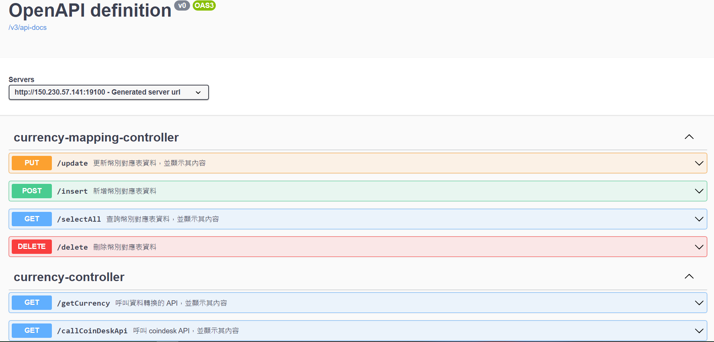

# spring-boot-haochih-demo
## 測試環境  
- Linux ubuntu 18(Oracle Cloud)
- arm64
- Open JDK:11.0.16

## Docker Demo頁面
[Swagger UI(open api 3.0)](http://150.230.57.141:19100/swagger-ui/index.html)


## Quick Deploy 
1. 拉取專案並切換至專案根目錄
```
git checkout https://github.com/sdes5317/spring-boot-haochih-demo.git
cd spring-boot-haochih-demo
```
2. Build docker image
```
sudo bash docker-image-build.sh
```
3. Run docker compose
```
sudo docker-compose up -d
```

## Todo list
- [ ] 全域錯誤處理
- [ ] log紀錄
- [ ] 簡化佈署腳本
